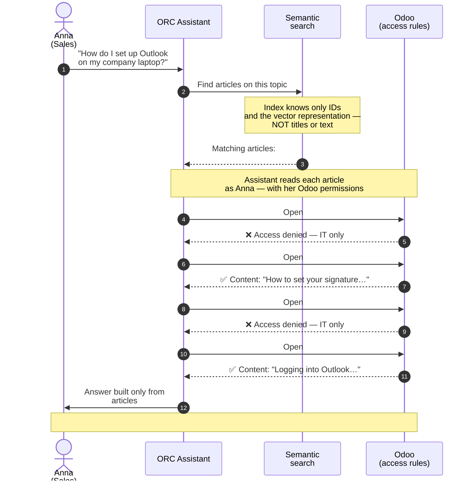

# Semantic search — security and visibility

A business-user explainer for how the ORC assistant finds
information in the Odoo knowledge base, and why it can never
show a user content they wouldn't be allowed to read — even when
an article containing the answer exists.

---

## In short

1. **The index returns only article IDs.** It does not know
   titles or content — only that a given article exists and
   matches the topic of the question.
2. **The assistant fetches the content as YOU.** It uses your
   own Odoo permissions — exactly the same rules that apply when
   you click the article manually. Departments, groups, roles in
   Odoo are the sole decision about visibility.
3. **No permission = article skipped.** The assistant simply
   doesn't read it and doesn't mention it in the answer. The
   user never even learns that the article existed.

The takeaway: there is no "second layer" of security to maintain.
What you configure in Odoo applies to the assistant too.

---

## Example: Anna from Sales asks about Outlook

Anna works in the **Sales department**. She writes to the
assistant:

> *"How do I set up Outlook on my new company laptop?"*

The knowledge base contains four articles whose content matches
this question. Some are tagged as internal to the IT team; some
are available to all employees.

| ID  | Title                                                  | Odoo access rule     |
|-----|--------------------------------------------------------|----------------------|
| 287 | Outlook configuration for IT team (PowerShell script)  | IT department only   |
| 312 | How to set your Outlook signature                      | All employees        |
| 401 | Password policy — administrator requirements           | IT department only   |
| 423 | Logging into corporate Outlook — step by step          | All employees        |

Anna belongs to Sales, so Odoo lets her see only #312 and #423.
The other two are invisible to her.

### What happens under the hood

### What Anna sees in the chat

The assistant replies with something like:

> To set up Outlook on your company laptop, follow the steps in
> **"Logging into corporate Outlook — step by step"** (`#423`).
> Once you're signed in, you may also want to set your company
> signature — that's covered in **"How to set your Outlook
> signature"** (`#312`).

The assistant **will not mention** articles #287 or #401 — it
won't know their titles, won't quote their content, won't even
suggest "ask IT, they have a more detailed guide" based on
those articles. From Anna's and the assistant's point of view,
they don't exist.

If the same conversation happened with an IT administrator (say,
**Mark**), Odoo would grant access to all four articles. The
assistant would build its answer from the full set — including
the internal PowerShell scripts.

---

## What this means for your organization

| Business question                                              | Answer                                                                                                                                |
|----------------------------------------------------------------|---------------------------------------------------------------------------------------------------------------------------------------|
| Do we need to configure separate permissions for the assistant? | No. The rules you already have in Odoo on knowledge base articles apply to the assistant in exactly the same way.                     |
| Does the assistant "see" all articles and just filter display?  | No. The assistant gets *access denied* from Odoo on restricted articles — it never has their content in memory.                       |
| Are assistant operations auditable?                             | Yes. Every article read by the assistant is an Odoo call identical to a manual click — recorded in standard Odoo logs.               |
| What if Anna should see #287 but Odoo refuses?                  | The admin checks the access rules on that one article in Odoo. The assistant requires no separate configuration.                      |
| How does the assistant decide which articles to actually read?  | It takes the 1–3 best matches from the index (highest similarity to the question). The rest are skipped by default.                   |

---

## What the index **knows** and **doesn't know**

| Knows                                                        | Doesn't know                                                       |
|--------------------------------------------------------------|--------------------------------------------------------------------|
| That an article on a given topic exists in the base          | Who is allowed to read it                                          |
| Article IDs (numbers)                                        | Article titles                                                     |
| Vector representation of content (a sequence of numbers)     | Content in readable form (text, images, attachments)               |
| That your question matches specific IDs                      | Whether you (as a user) have the right to open them                |

If someone unauthorised reached the index itself — they would
see a set of numbers and number sequences. No content. No names.
No password policies, scripts, or configurations.

---

## Practical implications for administrators

- **Odoo access rules remain the single source of truth.** You
  still configure them the same way: IT → restricted, all
  employees → public, board → its own, etc.
- **Audit is unchanged.** Odoo logs see every article open —
  through the user's browser and through the assistant alike.
  No separate monitoring engine.
- **Onboarding a new employee** reduces to granting them
  permissions in Odoo. The assistant will automatically start
  surfacing the articles the admin has deemed appropriate.
- **Off-boarding**: once permissions are removed, the assistant
  immediately stops letting that person into restricted
  articles — no separate "unhook from AI" action required.
